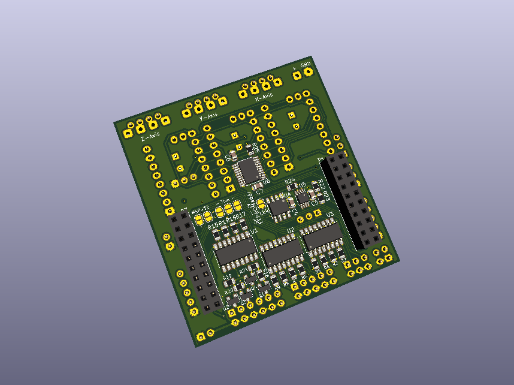

## CNC BoosterPack for Texas Instruments LaunchPads

A BoosterPack that provides 3-axis motor support for some LaunchPads, driver code for my [grbl-library](https://github.com/terjeio/grblHAL) is now available for MSP432, Tiva C (EK-TM4C123GXL and EK-TM4C1294XL) and MSP430F5529.

Prototype "motherboards" has been made for ESP32 and SAMD 21 (MKR ZERO) development boards allowing the CNC BoosterPack to be used with these, I may add them later.

**NOTE:** design files are in KiCad 5 format!

**Features:**

* 3-axis motor support with separate enable for Z and X,Y (X,Y has a single enable signal).

* On-board sockets for Polulu style motor driver modules (A4998 and DRV8825). Support for SPI-controlled Trinamic drivers planned, requires a daughter board.

* Opto-coupled limit and signal inputs (X, Y, Z, Probe, Reset, Door, Feed Hold and Cycle Start) with 5V drive voltage.

* Opto-coupled signal outputs (Spindle on, Spindle direction, Flood and Mist) with jumper selectable drive voltage (5V internal or externally supplied). Outputs are open drain (2N7002) capable of draining 200mA (up to 300mA depending on 2N7002 variant), enough to drive most relays directly. Outputs can be made opto-isolated via jumper settings.

* PWM output for spindle speed control, unbuffered.

* One I2C port with jumper selectable drive voltage (3.3V or 5V). This is complemented with a GPIO pin that may be used as an interrupt source, eg. for a I2C-based keypad.

* Two GPIO ports, one with four pins and one with two. Two-pin GPIO-port may be used as secondary UART input, eg. for MPG control.

* Optional on-board EEPROM for persistent storage of settings.

Separate version for Trinamic TMC2130 drivers added, onboard I2C <> SPI bridge for driver control. 4-layer board.

Detailed documentation to follow.

---

## Bonus design: Polulu style motor driver "dummy"

* with buffered (open drain) outputs for external drivers like DQ542MA.

**NOTE:** output signals are inverted

---

## Bonus design II: BLDC Motor driver board, 3.3V (or 5V) PWM to 0 - 10V DC conversion

* with opto-coupled PWM input.

* PCB layout matches WSS55 BLDC Driver connector

